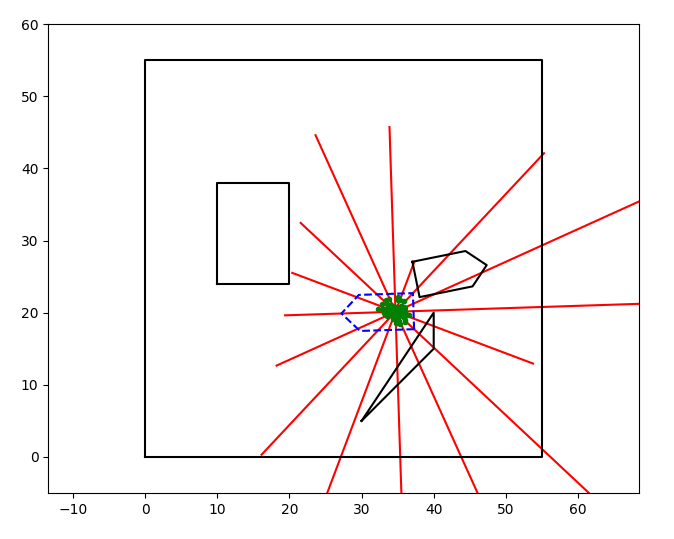
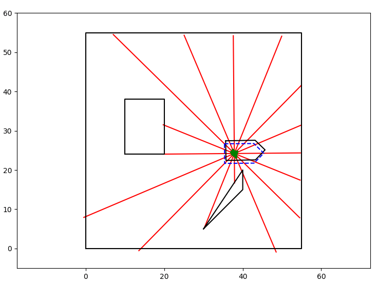
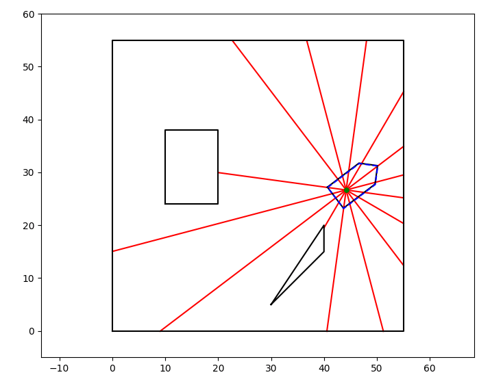

<head>
</head>
<body>

<h1>Particle Filter Localization Demo</h1>

</p>
<br>
<p>Understand Particle Filter by example and animations.</p>

<h1>Example</h1>
<h2>Relocalization</h2>
<div style="vertical-align:middle; text-align:center">
        
</div>

<h2>Localization with vibration</h2>
<div style="vertical-align:middle; text-align:center">
        
</div>

<h2>Stable Localization</h2>
<div style="vertical-align:middle; text-align:center">
        
</div>

<h1>Setup</h1>
<h2>Prerequisite</h2>
<ul>
<li>Eigen3</li>
<li>python3</li>
<li>matplotlib</li>
</ul>
<h2>Install</h2>

```
sudo apt-get install cmake python3 python3-matplotlib libeigen3-dev
```
<h2>Compile</h2>

```
mkdir build
cd build
cmake ..
make -j8
make install
```


</table>
<h1>References</h1>
<p>
    <ul>
        <li>
            <a href="http://www.probabilistic-robotics.org/">Probabilistic Robotics</a>
        </li>
        <li>
            <a href="https://cse.sc.edu/~terejanu/files/tutorialMC.pdf">Tutorial on Monte Carlo Techniques</a>
        </li>
        <li>
            <a href="https://github.com/AtsushiSakai/PythonRobotics/blob/master/Localization/particle_filter/particle_filter.py">PythonRobotics Paricle Filter Localization</a>
        </li>
    </ul>
</p>
<hr>
<h2>Author</h2>
<ul>
<li>Xiaoxing Chen</li>
</ul>
</body>

